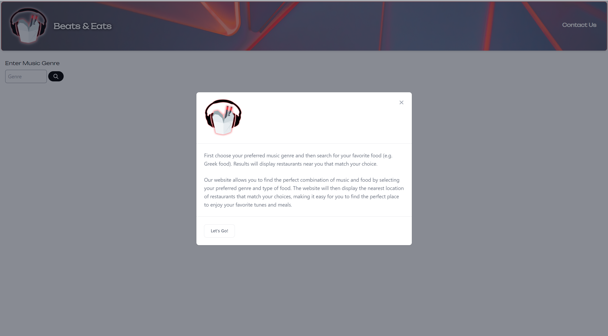
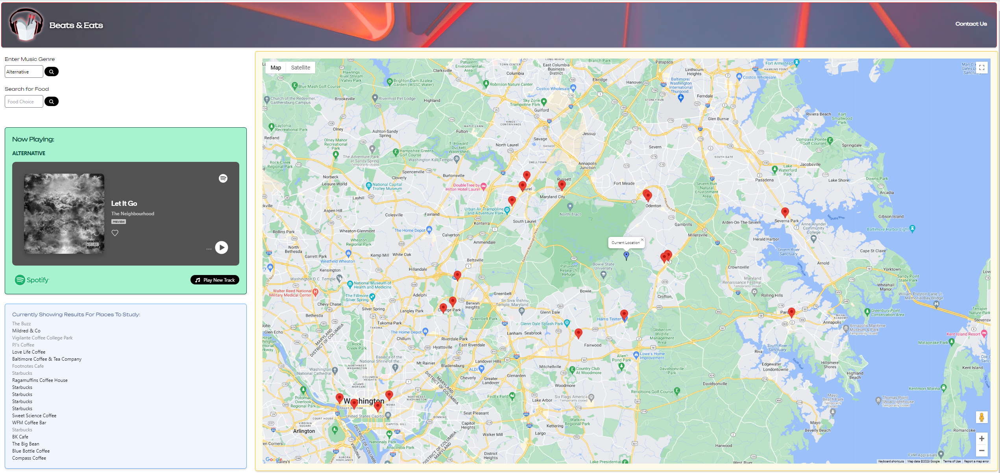

# BeatsAndEats

Created and coded by "A Hungry Team"

## Description

Have you ever needed a pick me up during, before or after studying for your class? We have got the app for you! You can pick your music, then select what type of food you’re in the mood for and we will do the rest!

## Instructions

When the page loads, you will be greeted by a modal containing a description and instructions. Once you pass the modal, first pick your preference in music genre (heads up, autocomplete is enable and you may scroll through some options after typing one letter). After your first track loads, you will be presented with Places to Study in the search results. If you would like to find other places, such as places with Greek Food, you may do so by using the Food Choice input box. If no results are shown, try using keywords in your search such as 'food' or 'shop'. Results will be shown as markers on the map and will be dispalyed as text under the music player. They are sorted closest to farthest.

Good luck finding great beats and eats!

## Screenshot

## Link to Deployed Application

https://shobannah.github.io/BeatsAndEats

## Credits

1. "headback.jpeg" unsplash.com, https://unsplash.com/photos/azkczZ4rOgk

## Purpose/Usage

Using the Spotify and Google Maps APIs so we can leverage our app to provide all your musical needs and eating preferences. Go find some Beats and Eats!

## License

Please refer to the LICENSE in the repo.

---
